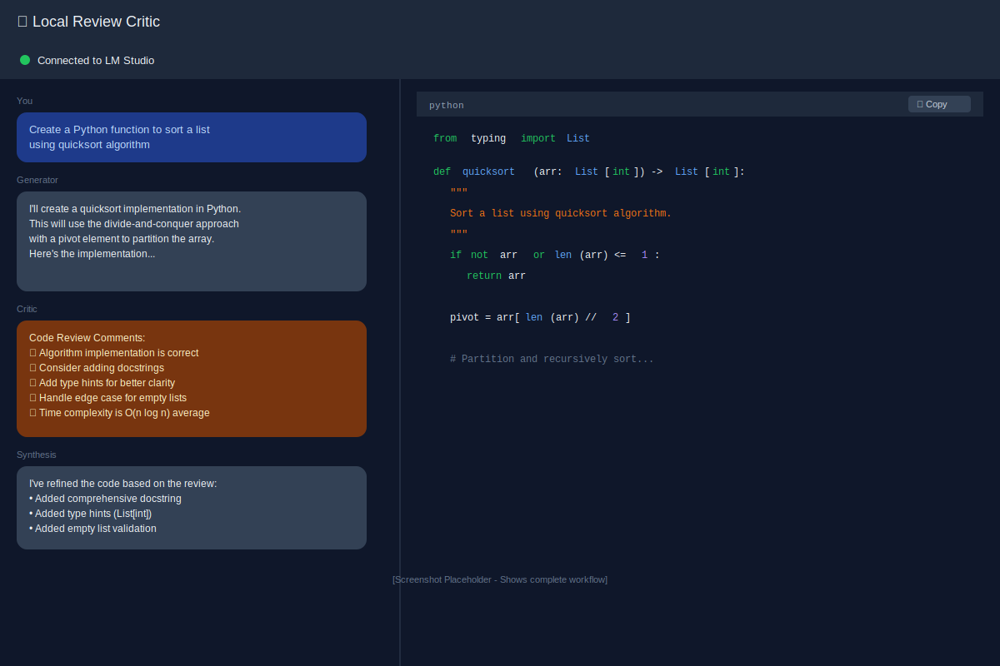
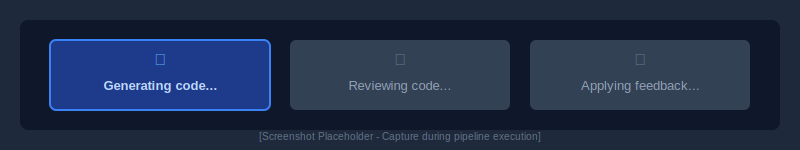
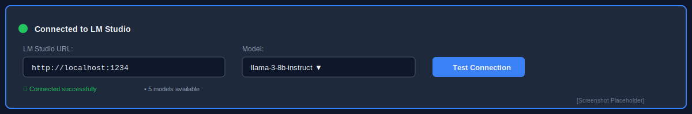

# Local-Review-Critic

> A multi-agent code generation and review platform powered by local language models

Local-Review-Critic is a full-stack web application that combines local language models with a sophisticated three-step code refinement pipeline to generate, review, and improve code based on user prompts. All processing happens locally using [LM Studio](https://lmstudio.ai/), ensuring your code never leaves your machine.


*Split-pane interface with chat on the left and syntax-highlighted code viewer on the right*

## ✨ Features

- **Multi-Agent Workflow**: Three specialized agents work together to produce high-quality code
  - 🤖 **Generator Agent**: Creates initial code based on your requirements
  - 🔍 **Critic Agents**: Two complementary review perspectives
    - ✨ **Optimistic Coding**: Reviews strengths, good patterns, and best practices
    - 🛡️ **Pessimistic/Defensive Coding**: Reviews potential issues, edge cases, and security concerns
  - ✨ **Synthesis Agent**: Refines code incorporating all feedback

- **Button-Controlled Execution**: Step through the pipeline at your own pace
  - Review generated code before requesting critique
  - Examine critic feedback before applying changes
  - Full control over each stage of the process

- **Thinking Model Support**: See the reasoning process of thinking models
  - Captures and displays internal reasoning from models like o1
  - Purple "🤔 Thinking" messages show model's thought process
  - Gain insights into how the model approaches problems

- **Split-Pane Interface**:
  - Chat history with real-time agent conversations
  - Syntax-highlighted code viewer with copy functionality

- **Local-First Privacy**: Uses LM Studio for completely local LLM execution
- **Real-Time Updates**: Live connection status and pipeline phase indicators
- **Flexible Configuration**: Configurable LM Studio URL and model selection
- **Security-Focused**: SSRF prevention with loopback-only URL validation

## 🏗️ Architecture

```
User Prompt
    ↓
┌─────────────────────┐
│  Generator Agent    │ ← Generates initial code
└──────────┬──────────┘
           ↓
┌─────────────────────┐
│   Critic Agents     │ ← Dual perspectives:
│                     │   • Optimistic (strengths, patterns)
│                     │   • Pessimistic (issues, defensive)
└──────────┬──────────┘
           ↓
┌─────────────────────┐
│  Synthesis Agent    │ ← Refines code with feedback
└──────────┬──────────┘
           ↓
    Final Code
```

### Multi-Agent Workflow in Action


*Complete workflow showing user prompt, agent responses (Generator → Critic → Synthesis), and final refined code*

### Pipeline Progress Indicators


*Real-time phase indicators during code generation: Generating → Reviewing → Applying feedback*

## 📋 Prerequisites

- **Python 3.8+**
- **Node.js 16+** and npm
- **LM Studio** ([Download here](https://lmstudio.ai/))
  - Install and download at least one language model
  - Start the local server (default: `http://localhost:1234`)

## 🚀 Installation

### 1. Clone the Repository

```bash
git clone https://github.com/raux/Local-Review-Critic.git
cd Local-Review-Critic
```

### 2. Backend Setup

```bash
cd backend

# Create and activate virtual environment
python -m venv venv
source venv/bin/activate  # On Windows: venv\Scripts\activate

# Install dependencies
pip install -r requirements.txt

# Configure LM Studio connection
# Create a .env file from the template if available:
cp backend/.env.example .env  # If .env.example exists, or create .env manually
# Edit .env and set:
# LM_STUDIO_BASE_URL=http://localhost:1234/v1
# LM_STUDIO_MODEL=  # Optional: specify model name
```

### 3. Frontend Setup

```bash
cd ../frontend

# Install dependencies
npm install
```

## 🎯 Usage

### Starting the Application

You need to run both the backend and frontend servers:

**Terminal 1 - Backend:**
```bash
cd backend
source venv/bin/activate  # On Windows: venv\Scripts\activate
uvicorn main:app --reload --host 0.0.0.0 --port 8000
```

**Terminal 2 - Frontend:**
```bash
cd frontend
npm run dev
```

The application will be available at `http://localhost:5173`

### Using the Application

1. **Configure LM Studio**:
   - Ensure LM Studio is running with a model loaded
   - In the UI, verify the connection status shows "● Connected"
   - Select your preferred model from the dropdown (optional)


*LM Studio configuration panel with connection status, URL input, and model selection*

2. **Generate Code**:
   - Enter your code requirements in the chat input
   - Press Enter or click Send
   - Wait for the Generator to create initial code
   - Review the generated code in the right panel

3. **Review Code** (Button-Controlled):
   - Choose between two review perspectives:
     - **✨ Optimistic Review**: Highlights strengths and good practices
     - **🛡️ Pessimistic/Defensive Review**: Identifies issues, edge cases, and security concerns
   - You can request both reviews or just one
   - Review the feedback in the chat

4. **Apply Changes** (Button-Controlled):
   - Click the "✨ Apply Changes" button when ready
   - The Synthesis agent will create the final improved code
   - The refined code appears in the code viewer

5. **Start New Request**:
   - Click "Start New Request" to begin again
   - The interface resets for your next prompt

> **Note**: Each step is now controlled by a button click, giving you full control over the pipeline. You can review each stage's output before proceeding to the next.

For detailed usage instructions, see [STEP_BY_STEP_USAGE.md](STEP_BY_STEP_USAGE.md).

6. **View Results**:
   - Chat history appears in the left pane showing all agent interactions
   - Final refined code appears in the right pane with syntax highlighting
   - Use the copy button to grab the code

## 🔌 API Documentation

### Base URL
```
http://localhost:8000
```

### Endpoints

#### `GET /health`
Health check endpoint.

**Response:**
```json
{
  "status": "healthy"
}
```

#### `GET /status`
Check LM Studio connection status.

**Response:**
```json
{
  "lm_studio_connected": true,
  "available_models": ["model-name-1", "model-name-2"]
}
```

#### `POST /chat`
Execute the multi-agent code generation pipeline.

**Request Body:**
```json
{
  "prompt": "Create a Python function to calculate fibonacci numbers",
  "lm_studio_url": "http://localhost:1234",  // Optional
  "model": "model-name"  // Optional
}
```

**Response:**
```json
{
  "code": "def fibonacci(n):\n    ...",
  "messages": [
    {"role": "generator", "content": "..."},
    {"role": "optimistic_critic", "content": "..."},
    {"role": "pessimistic_critic", "content": "..."},
    {"role": "synthesis", "content": "..."}
  ]
}
```

## 🛠️ Development

### Project Structure

```
Local-Review-Critic/
├── backend/                    # FastAPI backend
│   ├── main.py                # API routes and server setup
│   ├── agents.py              # Multi-agent pipeline logic
│   ├── requirements.txt       # Python dependencies
│   └── .env                   # Configuration
│
├── frontend/                  # React frontend
│   ├── src/
│   │   ├── App.jsx           # Main application layout
│   │   ├── api.js            # API client and LM Studio helpers
│   │   └── components/
│   │       ├── Chat.jsx              # Chat interface
│   │       ├── CodeViewer.jsx        # Code display
│   │       ├── LmStudioConfig.jsx    # LM Studio configuration
│   │       └── LoadingStates.jsx     # Pipeline indicators
│   ├── package.json
│   └── vite.config.js
│
└── README.md
```

### Technology Stack

**Backend:**
- FastAPI 0.115.5 - Modern Python web framework
- Uvicorn - ASGI server
- OpenAI Python client 1.35.3 - LM Studio compatibility
- HTTPX - Async HTTP for health checks
- Pydantic - Data validation

**Frontend:**
- React 18.3.1 - UI library
- Vite 5.3.1 - Build tool and dev server
- Tailwind CSS 3.4.4 - Styling
- Axios 1.13.5 - HTTP client
- React Syntax Highlighter 15.5.0 - Code display
- Lucide React - Icons

### Available Scripts

**Backend:**
```bash
uvicorn main:app --reload        # Development server
uvicorn main:app --host 0.0.0.0  # Production server
```

**Frontend:**
```bash
npm run dev      # Start development server
npm run build    # Build for production
npm run preview  # Preview production build
npm run lint     # Run ESLint
```

## 🔒 Security Features

- **SSRF Prevention**: LM Studio URL validation restricted to loopback addresses only
- **Local Processing**: All LLM inference happens locally via LM Studio
- **No External API Calls**: Code never leaves your machine
- **CORS Configuration**: Configurable middleware for secure cross-origin requests

## 🐛 Troubleshooting

### LM Studio Connection Issues

**Problem:** "LM Studio not connected" message

**Solutions:**
1. Verify LM Studio is running:
   - Open LM Studio application
   - Go to the "Local Server" tab
   - Ensure the server is started (green indicator)

2. Check the URL:
   - Default: `http://localhost:1234`
   - Ensure no other service is using port 1234
   - Try configuring a different port in LM Studio settings

3. Load a model:
   - Download a model in LM Studio (e.g., Llama, Mistral)
   - Load the model before starting the server

### Backend Fails to Start

**Problem:** Import errors or dependency issues

**Solution:**
```bash
cd backend
pip install --upgrade pip
pip install -r requirements.txt --force-reinstall
```

### Frontend Build Errors

**Problem:** npm install failures

**Solution:**
```bash
cd frontend
rm -rf node_modules package-lock.json
npm install
```

### Port Already in Use

**Problem:** Port 8000 or 5173 already in use

**Solution:**
```bash
# Backend: Change port in uvicorn command
uvicorn main:app --reload --port 8001

# Frontend: Vite will automatically try the next available port
# Or configure in vite.config.js
```

## 🤝 Contributing

Contributions are welcome! Please feel free to submit a Pull Request.

1. Fork the repository
2. Create your feature branch (`git checkout -b feature/AmazingFeature`)
3. Commit your changes (`git commit -m 'Add some AmazingFeature'`)
4. Push to the branch (`git push origin feature/AmazingFeature`)
5. Open a Pull Request

## 📄 License

This project is licensed under the MIT License - see the [LICENSE](LICENSE) file for details.

## 👤 Author

**Raula Gaikovina Kula**

## 🙏 Acknowledgments

- [LM Studio](https://lmstudio.ai/) - Local LLM runtime
- [FastAPI](https://fastapi.tiangolo.com/) - Modern Python web framework
- [React](https://react.dev/) - UI library
- [Vite](https://vitejs.dev/) - Frontend build tool

---

**Note:** This application requires LM Studio to be running locally. No code or prompts are sent to external servers, ensuring complete privacy and control over your data.